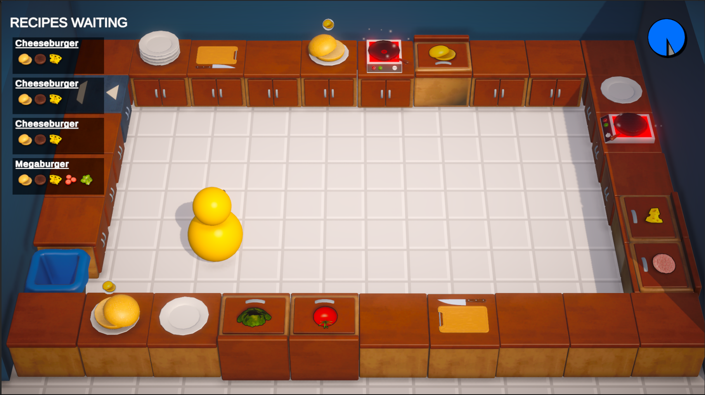
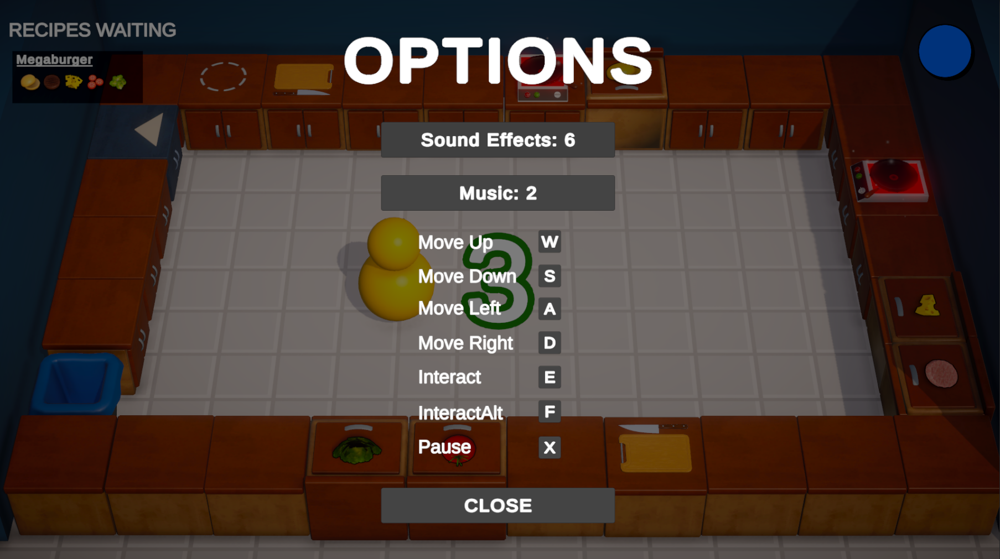

# 🍳 Recipe Riot

**A Fast-Paced Cooking Game Built with Unity**  
> Practice project inspired by [CodeMonkey's](https://youtu.be/AmGSEH7QcDg?si=WW3_7XjPcZOT9TMW) YouTube tutorial.

---

## 🎮 Game Overview

**Recipe Riot** is a fun and fast-paced cooking simulation game where you manage a kitchen, fulfill food orders, and serve them on time! As you progress, the orders become more frequent and challenging, testing your multitasking and time-management skills.

This project was developed as part of my Unity learning journey by following a tutorial presented on YouTube. While the core mechanics are based on the tutorial, I’ve polished and personalized several elements to enhance the experience.

---

## 🧩 Key Features

- ✅ **Smooth Player Movement** using Arrow or WASD keys.
- 🔥 **Immersive Audio** with realistic chopping and sizzling bacon sounds.
- ⏰ **Progressive Difficulty** – more complex and frequent orders as you advance.
- 🎯 **Intuitive Interactions** – use `E` to interact with counters, pickups, and delivery stations.
- 🎛️ **Custom Key Bindings** – remap movement and interaction controls.
- 🔊 **Adjustable Audio Settings** – control music and game sound levels from in-game menu.

---

## 🕹️ Controls

| Key          | Action                    |
|--------------|---------------------------|
| W / A / S / D or ↑ ↓ ← → | Move the player         |
| E            | Interact with counters / serve food |

---

## 🛠 Built With

- **Engine:** Unity (C#)
- **Platform:** Windows (Android version coming soon)
- **Tutorial Base:** [CodeMonkey - YouTube](https://youtu.be/AmGSEH7QcDg?si=WW3_7XjPcZOT9TMW)

---

## 🙏 Credits

- **Tutorial Base Game:** [CodeMonkey](https://youtu.be/AmGSEH7QcDg?si=WW3_7XjPcZOT9TMW)
- **Audio Assets:** Provided in tutorial or Unity Asset Store
- **All Rights** to the original game design belong to the tutorial creator. This version is a non-commercial educational project.

---

## 📝 License

This project is for **educational and portfolio use only**. Not intended for commercial release or redistribution.

---

## 📸 Screenshots

---

## 📫 Connect With Me

Want to collaborate or see more of my work?  
- 🔗 [LinkedIn](https://www.linkedin.com/in/kushwaha-rajat-kamalakant/)
- 📧 Email: rajatkshwh131@gmail.com 

---

